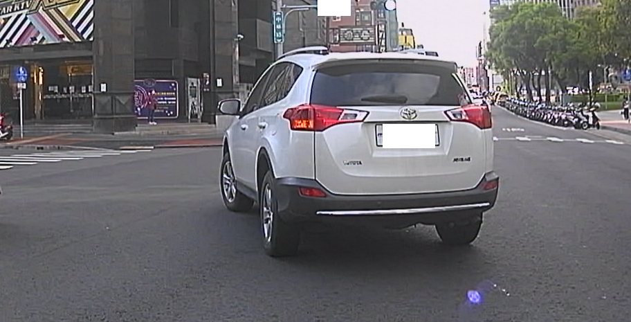
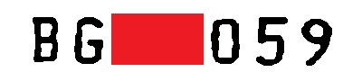

# licencse plate recognition
- [x] yolov5
- [ ] train self licencse plate model
- [ ] train self licencse plate detect model
- [x] preprocessing of data with craft and opencv

# Usage CRAFT, YOLOv5:
CRAFT is an open source from [here](https://github.com/clovaai/CRAFT-pytorch)  
YOLOv5 is an open source from [here](https://github.com/ultralytics/yolov5) 

## How to use
```shell
python detect_lp_num_new.py --source $DATA_PATH
```
### compare with using preprocessing or not
```shell
python compare.py --source $DATA_PATH --view-img
```

# Preprocessing
Before preprocessing  

After preprocessing  
